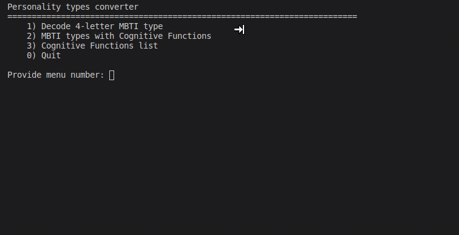
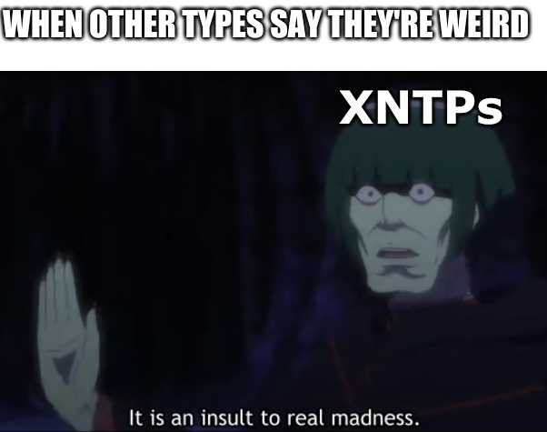

# mbti-converter

MBTI personality type to cognitive functions converter (decoder)

### Motivation

1) I was currious about cognitive functions for different personality types but was too lazy to do a conversion by hand each time and found only instructions how to do that in the Internet.
2) Didn't want to use simple dictionary for that but to implement the actual steps for manual conversion.

> Steps are taken from here: https://www.psychologyjunkie.com/2018/04/01/decoding-your-myers-briggs-personality-type/

### Features

* get cognitive functions stac for a specific MBTI 4-letter type
* show all possible MBTI types with corresponding cognitive functions
* show all possible cognitive functions
* _new features are yet to come_

### Usage

Run `converter_terminal.py` in terminal

### Example

### Link on topic

* https://personalityjunkie.com/typology-101/
* https://personalityjunkie.com/functions-ni-ti-fi-si-ne-te-fe-se/
* https://www.psychologyjunkie.com/2018/04/01/decoding-your-myers-briggs-personality-type/

### Fave fun

### Feedback

For enhancement or a bug create an issue, please.
